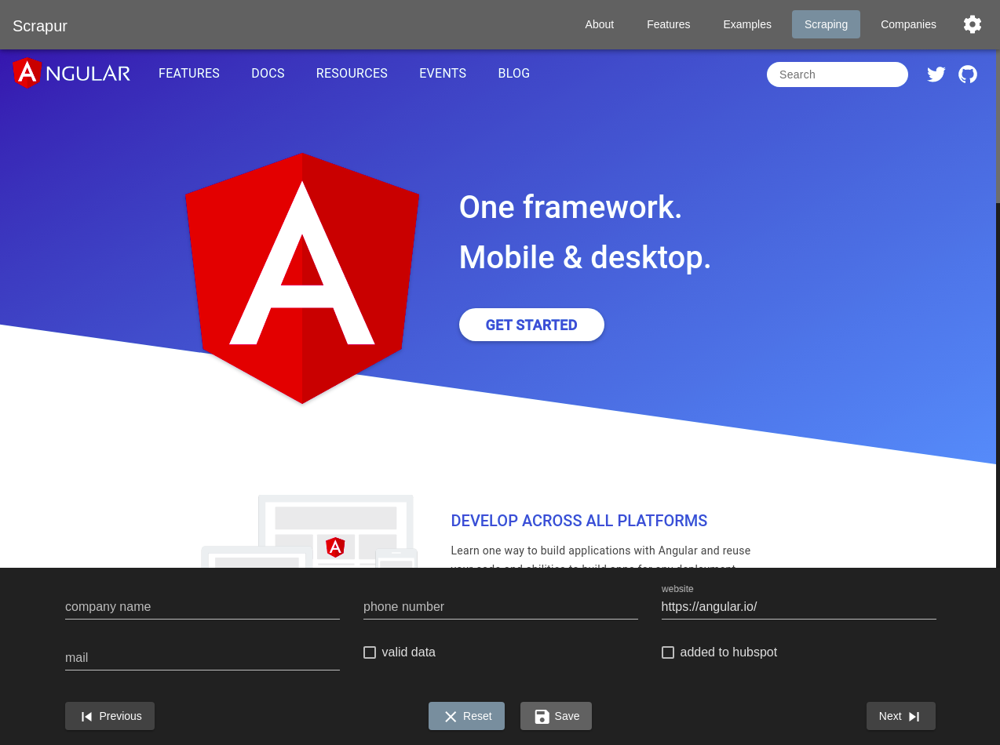

# Scrapur

by [@dome4](https://github.com/dome4)

<!-- ## Table of Content

- [Live Demo](https://tomastrajan.github.io/angular-ngrx-material-starter)
- [Getting Started](#getting-started)
- [Useful Commands](#useful-commands)
- [Make It Your Own](#make-it-your-own)
- [Goals](#goals)
- [Learning Materials](#learning-materials)
- [List of Projects Built Using This Starter](https://github.com/tomastrajan/angular-ngrx-material-starter/blob/master/BUILT_WITH.md)
- [Features](#features)
- [Stack](#stack)
- [Code of Conduct](https://github.com/tomastrajan/angular-ngrx-material-starter/blob/master/CODE_OF_CONDUCT.md)
- [Contributors Guide](https://github.com/tomastrajan/angular-ngrx-material-starter/blob/master/CONTRIBUTING.md)
- [Changelog](https://github.com/tomastrajan/angular-ngrx-material-starter/blob/master/CHANGELOG.md) ( get notified about the newest releases, [follow Release Butler](https://twitter.com/releasebutler) on Twitter ) -->

## Features (done)

- none

## Features (planned)

- companies state
- company datagrid (read only)
- local storage service
- JSON document upload
- iFrame view
- CSV document upload
- document validation
- company datagrid (CRUD)

## Stack

- [Angular](https://angular.io/)
- [Clarity](https://clarity.design/)
- [RxJS](https://github.com/reactivex/rxjs)
- [Lodash](https://github.com/lodash/lodash)
